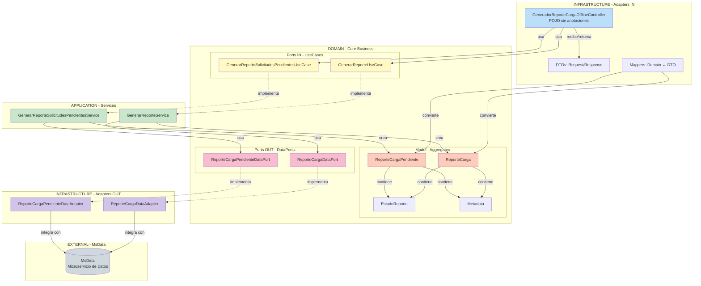
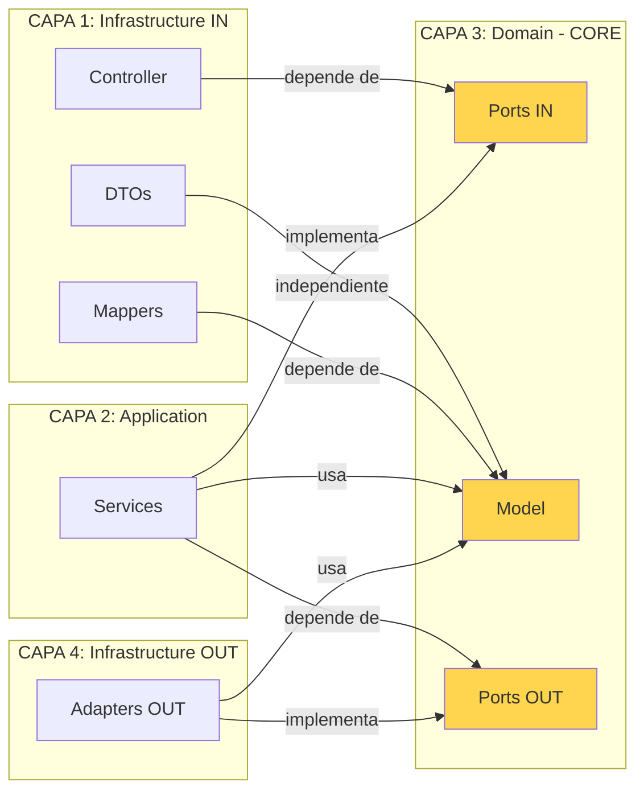

# Diagrama de Clases - MsDominioGeneradorReporteCargaOffline

## Arquitectura Hexagonal Completa

```mermaid
classDiagram
    %% ============================================================
    %% CAPA DE DOMINIO - Domain Layer (Núcleo del negocio)
    %% ============================================================

    namespace Domain_Model {
        class ReporteCarga {
            -String idReporteCargue
            -Integer cantidadTramitesTransferido
            -List~String~ logTramitre
            -EstadoReporte estadoReporte
            -Metadata metadata
            -String reporteBase64
            -String urlReporteRepositorio
            +ReporteCarga()
            +getters()
            +setters()
        }

        class ReporteCargaPendiente {
            -String idReportePendiente
            -Integer cantidadTramitesGestionados
            -EstadoReporte estadoReporte
            -Metadata metadata
            -String reporteBase64
            -String urlReporteRepositorio
            +ReporteCargaPendiente()
            +getters()
            +setters()
        }

        class EstadoReporte {
            <<Value Object>>
            -String tipo
            -List~String~ valor
            +EstadoReporte()
            +getters()
            +setters()
        }

        class Metadata {
            <<Value Object>>
            -LocalDateTime timestamp
            -String correlationId
            -String version
            +Metadata()
            +getters()
            +setters()
        }
    }

    namespace Domain_Ports_In {
        class GenerarReporteUseCase {
            <<interface>>
            +generar(String idCargueTramite) ReporteCarga
        }

        class GenerarReporteSolicitudesPendientesUseCase {
            <<interface>>
            +generar(String itineranteId) ReporteCargaPendiente
        }
    }

    namespace Domain_Ports_Out {
        class ReporteCargaDataPort {
            <<interface>>
            +guardar(ReporteCarga) ReporteCarga
            +buscarPorId(String) ReporteCarga
            +buscarPorIdCargueTramite(String) ReporteCarga
        }

        class ReporteCargaPendienteDataPort {
            <<interface>>
            +guardar(ReporteCargaPendiente) ReporteCargaPendiente
            +buscarPorId(String) ReporteCargaPendiente
            +buscarPorItineranteId(String) ReporteCargaPendiente
        }
    }

    %% ============================================================
    %% CAPA DE APLICACIÓN - Application Layer
    %% ============================================================

    namespace Application_Service {
        class GenerarReporteService {
            -ReporteCargaDataPort reporteCargaDataPort
            +GenerarReporteService(ReporteCargaDataPort)
            +generar(String idCargueTramite) ReporteCarga
        }

        class GenerarReporteSolicitudesPendientesService {
            -ReporteCargaPendienteDataPort reporteCargaPendienteDataPort
            +GenerarReporteSolicitudesPendientesService(ReporteCargaPendienteDataPort)
            +generar(String itineranteId) ReporteCargaPendiente
        }
    }

    %% ============================================================
    %% CAPA DE INFRAESTRUCTURA - Infrastructure Layer (Adaptadores)
    %% ============================================================

    namespace Infrastructure_Adapters_In_Controller {
        class GeneradorReporteCargaOfflineController {
            <<POJO>>
            -GenerarReporteUseCase generarReporteUseCase
            -GenerarReporteSolicitudesPendientesUseCase generarReporteSolicitudesPendientesUseCase
            +GeneradorReporteCargaOfflineController(...)
            +generarReporte(ReporteCargaRequestDto) ReporteCargaResponseDto
            +generarReporteSolicitudesPendientes(ReporteCargaPendienteRequestDto) ReporteCargaPendienteResponseDto
        }
    }

    namespace Infrastructure_Adapters_In_DTO {
        class ReporteCargaRequestDto {
            -String idCargueTramite
            +getters()
            +setters()
        }

        class ReporteCargaResponseDto {
            -ReporteCargueDto reporteCargue
            -String reporteBase64
            -String urlReporteRepositorio
            +getters()
            +setters()
        }

        class ReporteCargaPendienteRequestDto {
            -String itineranteId
            +getters()
            +setters()
        }

        class ReporteCargaPendienteResponseDto {
            -ReporteCarguePendienteDto reporteCarguePendiente
            -String reporteBase64
            -String urlReporteRepositorio
            +getters()
            +setters()
        }

        class ErrorResponseDto {
            -ErrorDto error
            +getters()
            +setters()
        }
    }

    namespace Infrastructure_Adapters_In_Mapper {
        class ReporteCargaDtoMapper {
            +toDto(ReporteCarga) ReporteCargaResponseDto
            +toDomain(ReporteCargaResponseDto) ReporteCarga
            -toEstadoReporteDto(EstadoReporte) EstadoReporteDto
            -toMetadataDto(Metadata) MetadataDto
        }

        class ReporteCargaPendienteDtoMapper {
            +toDto(ReporteCargaPendiente) ReporteCargaPendienteResponseDto
            +toDomain(ReporteCargaPendienteResponseDto) ReporteCargaPendiente
            -toEstadoReporteDto(EstadoReporte) EstadoReporteDto
            -toMetadataDto(Metadata) MetadataDto
        }
    }

    namespace Infrastructure_Adapters_Out_Client {
        class ReporteCargaDataAdapter {
            +guardar(ReporteCarga) ReporteCarga
            +buscarPorId(String) ReporteCarga
            +buscarPorIdCargueTramite(String) ReporteCarga
        }

        class ReporteCargaPendienteDataAdapter {
            +guardar(ReporteCargaPendiente) ReporteCargaPendiente
            +buscarPorId(String) ReporteCargaPendiente
            +buscarPorItineranteId(String) ReporteCargaPendiente
        }
    }

    %% ============================================================
    %% RELACIONES - Arquitectura Hexagonal
    %% ============================================================

    %% Composición - Domain Model
    ReporteCarga *-- EstadoReporte : contiene
    ReporteCarga *-- Metadata : contiene
    ReporteCargaPendiente *-- EstadoReporte : contiene
    ReporteCargaPendiente *-- Metadata : contiene

    %% Implementación - Application implementa Ports In
    GenerarReporteService ..|> GenerarReporteUseCase : implements
    GenerarReporteSolicitudesPendientesService ..|> GenerarReporteSolicitudesPendientesUseCase : implements

    %% Implementación - Adapters Out implementan Ports Out
    ReporteCargaDataAdapter ..|> ReporteCargaDataPort : implements
    ReporteCargaPendienteDataAdapter ..|> ReporteCargaPendienteDataPort : implements

    %% Dependencia - Services usan Ports Out
    GenerarReporteService --> ReporteCargaDataPort : usa
    GenerarReporteSolicitudesPendientesService --> ReporteCargaPendienteDataPort : usa

    %% Dependencia - Services usan Domain Model
    GenerarReporteService ..> ReporteCarga : crea/retorna
    GenerarReporteSolicitudesPendientesService ..> ReporteCargaPendiente : crea/retorna

    %% Dependencia - Controller usa Ports In
    GeneradorReporteCargaOfflineController --> GenerarReporteUseCase : usa
    GeneradorReporteCargaOfflineController --> GenerarReporteSolicitudesPendientesUseCase : usa

    %% Dependencia - Controller usa DTOs
    GeneradorReporteCargaOfflineController ..> ReporteCargaRequestDto : recibe
    GeneradorReporteCargaOfflineController ..> ReporteCargaResponseDto : retorna
    GeneradorReporteCargaOfflineController ..> ReporteCargaPendienteRequestDto : recibe
    GeneradorReporteCargaOfflineController ..> ReporteCargaPendienteResponseDto : retorna

    %% Dependencia - Mappers convierten entre Domain y DTO
    ReporteCargaDtoMapper ..> ReporteCarga : convierte
    ReporteCargaDtoMapper ..> ReporteCargaResponseDto : convierte
    ReporteCargaPendienteDtoMapper ..> ReporteCargaPendiente : convierte
    ReporteCargaPendienteDtoMapper ..> ReporteCargaPendienteResponseDto : convierte

    %% Dependencia - Adapters Out usan Domain Model
    ReporteCargaDataAdapter ..> ReporteCarga : gestiona
    ReporteCargaPendienteDataAdapter ..> ReporteCargaPendiente : gestiona

    %% Estilos y notas
    style ReporteCarga fill:#e1f5ff
    style ReporteCargaPendiente fill:#e1f5ff
    style EstadoReporte fill:#fff4e1
    style Metadata fill:#fff4e1
    style GenerarReporteUseCase fill:#e8f5e9
    style GenerarReporteSolicitudesPendientesUseCase fill:#e8f5e9
    style ReporteCargaDataPort fill:#ffe8e8
    style ReporteCargaPendienteDataPort fill:#ffe8e8
    style GenerarReporteService fill:#f3e5f5
    style GenerarReporteSolicitudesPendientesService fill:#f3e5f5
```

## Diagrama Simplificado - Flujo de Arquitectura Hexagonal

## Vista de Dependencias por Capa

## Leyenda

### Tipos de Clases
- **Aggregate Root**: Entidades principales del dominio (`ReporteCarga`, `ReporteCargaPendiente`)
- **Value Object**: Objetos de valor inmutables (`EstadoReporte`, `Metadata`)
- **Interface - Port IN**: Casos de uso que exponen operaciones del dominio
- **Interface - Port OUT**: Contratos para integraciones externas (hacia MsData)
- **Service**: Implementaciones de la lógica de negocio
- **Controller**: POJO que maneja requests HTTP (sin anotaciones)
- **DTO**: Objetos de transferencia de datos para la capa de presentación
- **Mapper**: Conversores entre Domain y DTOs
- **Adapter**: Implementaciones de puertos de salida

### Flujo de Datos (Arquitectura Hexagonal)
1. **Request** → Controller recibe HTTP request
2. **Mapping** → Mapper convierte DTO a Domain Model
3. **UseCase** → Controller llama al UseCase (Port IN)
4. **Service** → Service implementa el UseCase
5. **Business Logic** → Service ejecuta lógica usando Domain Model
6. **Port OUT** → Service usa DataPort para persistencia/integración
7. **Adapter** → DataAdapter implementa integración con MsData
8. **Response** → Mapper convierte Domain Model a DTO Response

### Características MsDominio
- ✅ Define **DataPorts** (NO RepositoryPorts)
- ✅ Usa **DataAdapters** para integración con MsData
- ✅ **NO** define Entities de persistencia
- ✅ Delega persistencia a MsData (microservicio externo)

---
**Generado:** 2025-12-04
**Arquitectura:** Hexagonal Estricta
**Tipo:** MsDominio
**Framework:** Java Puro (sin anotaciones)
